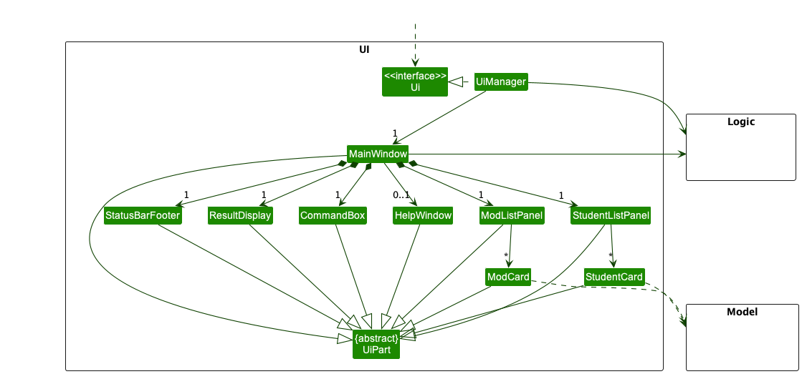
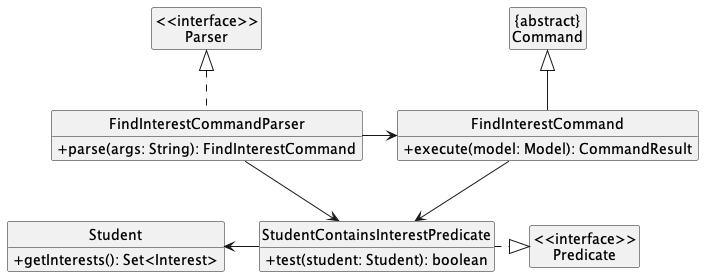
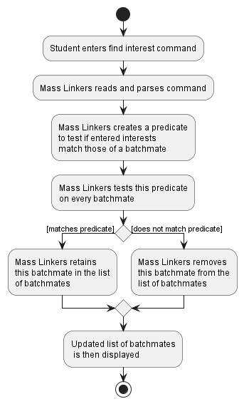
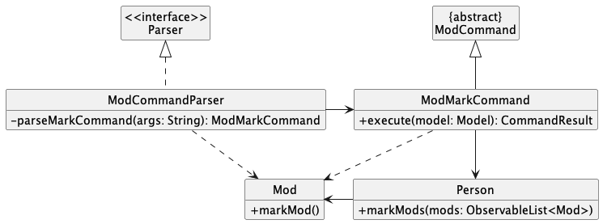
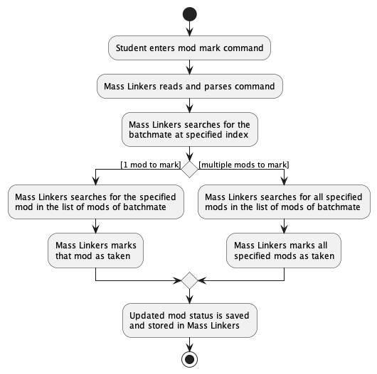
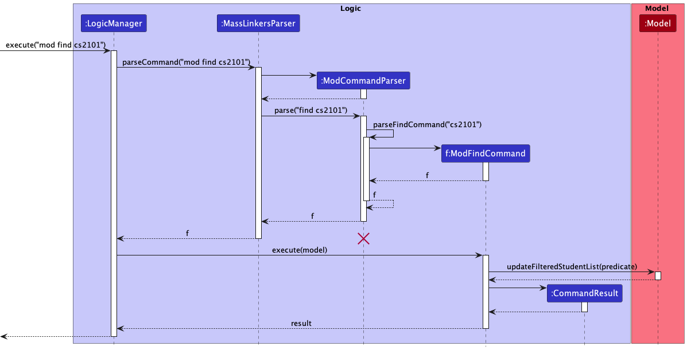
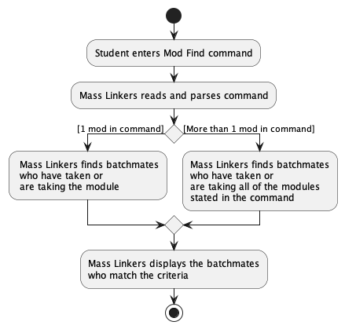
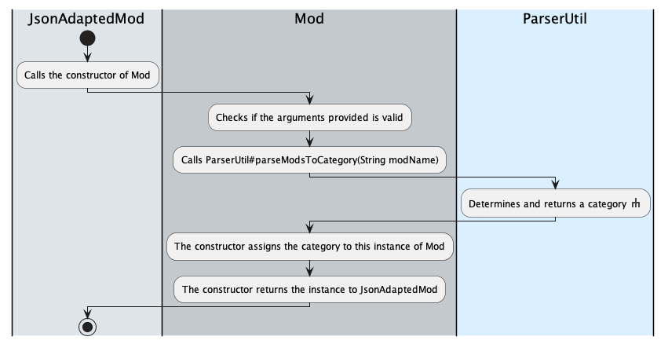
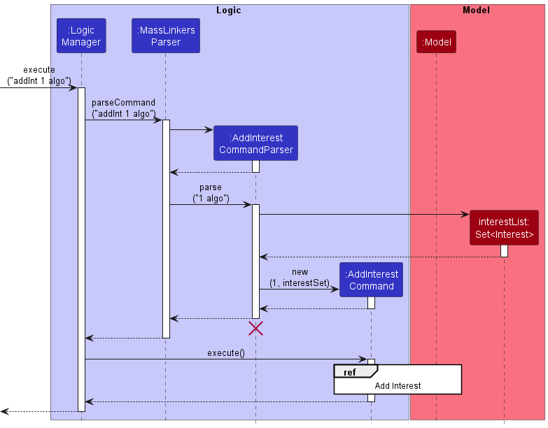
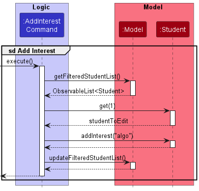

* Table of Contents
{:toc}

--------------------------------------------------------------------------------------------------------------------

## **Acknowledgements**

* {list here sources of all reused/adapted ideas, code, documentation, and third-party libraries -- include links to the original source as well}

--------------------------------------------------------------------------------------------------------------------

## **Setting up, getting started**

Refer to the guide [_Setting up and getting started_](SettingUp.md).

--------------------------------------------------------------------------------------------------------------------

## **Design**

<div markdown="span" class="alert alert-primary">

:bulb: **Tip:** The `.puml` files used to create diagrams in this document can be found in the [diagrams](https://github.com/se-edu/masslinkers-level3/tree/master/docs/diagrams/) folder. Refer to the [_PlantUML Tutorial_ at se-edu/guides](https://se-education.org/guides/tutorials/plantUml.html) to learn how to create and edit diagrams.
</div>

### Architecture


The ***Architecture Diagram*** given above explains the high-level design of the App.

Given below is a quick overview of main components and how they interact with each other.

**Main components of the architecture**

**`Main`** has two classes called [`Main`](https://github.com/se-edu/masslinkers-level3/tree/master/src/main/java/seedu/masslinkers/Main.java) and [`MainApp`](https://github.com/se-edu/masslinkers-level3/tree/master/src/main/java/seedu/masslinkers/MainApp.java). It is responsible for,
* At app launch: Initializes the components in the correct sequence, and connects them up with each other.
* At shut down: Shuts down the components and invokes cleanup methods where necessary.

[**`Commons`**](#common-classes) represents a collection of classes used by multiple other components.

The rest of the App consists of four components.

* [**`UI`**](#ui-component): The UI of the App.
* [**`Logic`**](#logic-component): The command executor.
* [**`Model`**](#model-component): Holds the data of the App in memory.
* [**`Storage`**](#storage-component): Reads data from, and writes data to, the hard disk.


**How the architecture components interact with each other**

The *Sequence Diagram* below shows how the components interact with each other for the scenario where the user issues the command `delete 1`.


Each of the four main components (also shown in the diagram above),

* defines its *API* in an `interface` with the same name as the Component.
* implements its functionality using a concrete `{Component Name}Manager` class (which follows the corresponding API `interface` mentioned in the previous point.

For example, the `Logic` component defines its API in the `Logic.java` interface and implements its functionality using the `LogicManager.java` class which follows the `Logic` interface. Other components interact with a given component through its interface rather than the concrete class (reason: to prevent outside component's being coupled to the implementation of a component), as illustrated in the (partial) class diagram below.


The sections below give more details of each component.

### UI component

The **API** of this component is specified in [`Ui.java`](https://github.com/se-edu/masslinkers-level3/tree/master/src/main/java/seedu/masslinkers/ui/Ui.java)



The UI consists of a `MainWindow` that is made up of parts e.g.`CommandBox`, `ResultDisplay`, `StudentListPanel`, `ModListPanel`, `StatusBarFooter` etc. All these, including the `MainWindow`, inherit from the abstract `UiPart` class which captures the commonalities between classes that represent parts of the visible GUI.

The `UI` component uses the JavaFx UI framework. The layout of these UI parts are defined in matching `.fxml` files that are in the `src/main/resources/view` folder. For example, the layout of the [`MainWindow`](https://github.com/se-edu/masslinkers-level3/tree/master/src/main/java/seedu/masslinkers/ui/MainWindow.java) is specified in [`MainWindow.fxml`](https://github.com/se-edu/masslinkers-level3/tree/master/src/main/resources/view/MainWindow.fxml)

The `UI` component,

* executes user commands using the `Logic` component.
* listens for changes to `Model` data so that the UI can be updated with the modified data.
* keeps a reference to the `Logic` component, because the `UI` relies on the `Logic` to execute commands.
* depends on some classes in the `Model` component, as it displays `Student` object residing in the `Model`.

### Logic component

**API** : [`Logic.java`](https://github.com/se-edu/masslinkers-level3/tree/master/src/main/java/seedu/masslinkers/logic/Logic.java)

Here's a (partial) class diagram of the `Logic` component:


How the `Logic` component works:
1. When `Logic` is called upon to execute a command, it uses the `MassLinkersParser` class to parse the user command.
1. This results in a `Command` object (more precisely, an object of one of its subclasses e.g., `AddCommand`) which is executed by the `LogicManager`.
1. The command can communicate with the `Model` when it is executed (e.g. to add a student).
1. The result of the command execution is encapsulated as a `CommandResult` object which is returned back from `Logic`.

The Sequence Diagram below illustrates the interactions within the `Logic` component for the `execute("delete 1")` API call.


<div markdown="span" class="alert alert-info">:information_source: **Note:** The lifeline for `DeleteCommandParser` should end at the destroy marker (X) but due to a limitation of PlantUML, the lifeline reaches the end of diagram.
</div>

Here are the other classes in `Logic` (omitted from the class diagram above) that are used for parsing a user command:


How the parsing works:
* When called upon to parse a user command, the `MassLinkersParser` class creates an `XYZCommandParser` (`XYZ` is a placeholder for the specific command name e.g., `AddCommandParser`) which uses the other classes shown above to parse the user command and create a `XYZCommand` object (e.g., `AddCommand`) which the `MassLinkersParser` returns back as a `Command` object.
* All `XYZCommandParser` classes (e.g., `AddCommandParser`, `DeleteCommandParser`, ...) inherit from the `Parser` interface so that they can be treated similarly where possible e.g, during testing.

### Model component
**API** : [`Model.java`](https://github.com/se-edu/masslinkers-level3/tree/master/src/main/java/seedu/masslinkers/model/Model.java)


The `Model` component,

* stores the mass linkers data i.e., all `Student` objects (which are contained in a `UniqueStudentList` object).
* stores the currently 'selected' `Student` objects (e.g., results of a search query) as a separate _filtered_ list which is exposed to outsiders as an unmodifiable `ObservableList<Student>` that can be 'observed' e.g. the UI can be bound to this list so that the UI automatically updates when the data in the list change.
* stores a `UserPref` object that represents the user’s preferences. This is exposed to the outside as a `ReadOnlyUserPref` objects.
* does not depend on any of the other three components (as the `Model` represents data entities of the domain, they should make sense on their own without depending on other components)

<div markdown="span" class="alert alert-info">:information_source: **Note:** An alternative (arguably, a more OOP) model is given below. It has a `Tag` list in the `MassLinkers`, which `Student` references. This allows `MassLinkers` to only require one `Tag` object per unique tag, instead of each `Student` needing their own `Tag` objects.<br>


</div>


### Storage component

**API** : [`Storage.java`](https://github.com/se-edu/masslinkers-level3/tree/master/src/main/java/seedu/masslinkers/storage/Storage.java)


The `Storage` component,
* can save both mass linkers data and user preference data in json format, and read them back into corresponding objects.
* inherits from both `MassLinkersStorage` and `UserPrefStorage`, which means it can be treated as either one (if only the functionality of only one is needed).
* depends on some classes in the `Model` component (because the `Storage` component's job is to save/retrieve objects that belong to the `Model`)

### Common classes

Classes used by multiple components are in the `seedu.masslinkers.commons` package.

--------------------------------------------------------------------------------------------------------------------

## **Implementation**

This section describes some noteworthy details on how certain features are implemented.

### Find Interest Feature

#### Implementation

The `FindInterestCommandParser` reads the specified interests entered by the student in `FindInterestCommandParser#parse`.
The specified interests are then passed as a `StudentContainsInterestPredicate` predicate for execution in `FindInterestCommand#execute`.

During execution, the interests of every batchmate will be tested against the aforementioned predicate.
If all interests specified are found in the set of a batchmates' interests, that batchmate will then be filtered out and displayed.
The result would be a list of all batchmates that are filtered out.

The following (partial) class diagram shows how the different classes involved in the find interest operation interact with one another:



The following activity diagram summarises what happens when a student enters a `findInt` command, assuming the command is valid and no error occurs:



#### Design considerations:

**Aspect: How `findInt` executes:**

* **Alternative 1 (current choice):** Finds all batchmates whose interests match all interests specified (i.e. a superset of those specified).
    * Pros: A specific search to find batchmates who have the same interests as the student. (Specifying `tennis` and `baking` will result in a batchmate whose interests are `tennis`, `baking` and `music` to be displayed)
    * Cons: Search might be too narrow since it excludes batchmates that have some but not all the interests specified. (Specifying `tennis` and `baking` will not result in a batchmate whose only interest is `tennis` to be displayed)

* **Alternative 2:** Finds all batchmates whose interests match at least one of the interests specified.
    * Pros: A more general search might be useful for finding a greater number of batchmates who share some of the interests as the student.
    * Cons: It diminishes the usefulness of being able to search for multiple interests at once if a general search is implemented. The purpose of specifying multiple interests is so that the search results would be specific.

### Mod mark feature

#### Implementation

The `ModCommandParser` implements the operation `ModCommandParser#parseMarkCommand(String args)` to read inputs entered by the student for execution in `ModMarkCommand`. `ModMarkCommand` extends `ModCommand` to execute the `mod mark` command.

During execution, all modules specified by the student are marked in the `Student` class with the operation `Student#markMods(ObservableList<Mod> mods)`. This is because the list of modules is stored and associated with a `Student`, hence any updates on the module status in the current list of modules will be handled in `Student`. Each individual module is then marked in the `Mod` class with the operation `Mod#markMod()`.

The following (partial) class diagram shows how the different classes involved in the mod mark operation interacts with one another:



The following activity diagram summarises what happens when a student enters a `mod mark` command, assuming the command is valid and no error occurs:



#### Design considerations:

**Aspect: How mod mark executes:**

* **Alternative 1 (current choice):** Marks mods of a batchmate whose index is specified.
    * Pros: Easier to implement. Shorter command to enter.
    * Cons: May be hard to find and locate the index of the batchmate especially when the list of batchmates is long.

* **Alternative 2:** Marks mods of a batchmate whose name is specified.
    * Pros: Easier to find the batchmate by directly entering the name.
    * Cons: Full name of the batchmate has to be specified. It may take more time to enter the name especially for long and complicated names.

### Mod find feature

#### Implementation

The `ModCommandParser` implements the operation `ModCommandParser#parseFindCommand(String args)` to read inputs entered by the student for execution in `ModFindCommand`. `ModFindCommand` extends `ModCommand` to execute the `mod find` command.

During execution, the user inputs of module codes are passed into a `List` to `ModContainsKeywordsPredicate`.

For simplicity, we will call this `List` of module codes `keywords`. `ModContainsKeywordsPredicate#test(Student student)` returns `true` for a particular `student` only if every elements in `keywords` is in the `Mod`s of this `student` (stored as `ObservableList<Mod>`).

Checking of whether the elements in the `keywords` and the `Mod`s match is done by the `StringUtil#containsWordIgnoreCase(String sentence, String word)`.

The result of `ModContainsKeywordsPredicate#test(Student student)` is then used by `Model#updateFilteredStudentList` to filter those `Students` who have taken or are taking the specified module(s)) when `ModFindCommand#execute(Model model)` is called.

The following sequence diagram shows how the different classes involved in the `mod find` operation interacts with one another:



The following activity diagram summarises what happens when a student enters a `mod find` command, assuming the command is valid and no error occurs:



#### Design considerations:

* **Alternative 1 (current choice):** Modules will be identified only if user inputs fully matches the module code. For instance, `mod find cs1231` does not return `student` has taken or is taking the module `CS1231S` (lacking an "S").
    * Pros: Reduces confusion. Requiring exact module code will display `students` that are tailored to the specifications, reducing the need to manually filter through the `students`. Imagine that if the system allows partial matching of module codes, typing `mod find cs` yields those who are taking or have taken modules with code "CS", regardless of whether he/she has "CS1231S".
    * Cons: If the desired module code is so unique that partial matching can suffice to pinpoint the module, requiring a fully matching input would cause some inconvenience to the user.

* **Alternative 2:** Modules can be identified by partially matching inputs of module codes. For instance, `mod find 123` will return `student` has taken or is taking the module `CS1231S`.
    * Pros: Shorter commands to enter and grants greater convenience to the users.
    * Cons: If many module codes share the partial module code that user inputs, many `students` will be returned, rendering the `mod find` function ineffective as users still need to manually search for the `students` with the desired module.

### Module Categorisation

#### Implementation

Module categorisation is handled by `ParserUtil#parseModsToCategory(String modName)`.
A category is assigned to every mod upon creating it through its constructor.
This categorisation is not saved in Storage.
The module categories can be viewed [here](UserGuide.md#module-categorisation)

Upon calling the constructor of `Mod` to create a new instance, the constructor
will then call `ParserUtil#parseModsToCategory(String modName)` which returns a `ModCategory`
corresponding to the `modName`.
A new `Mod` instance with its `modName` and `modCategory` is created.
This `modCategory` will later be used to colour code mods in the UI.

The (partial) sequence diagram below shows the categorisation of a new mod when
its constructor is called in `JsonAdaptedMod`.


The (partial) activity diagram below summarises what happens when a new mod is created in `JsonAdaptedMod`
assuming no errors occur.



Activity: Determines and returns a category


#### Design considerations:

**Aspect: How categorisation is handled:**

* **Alternative 1 (current choice):** All categorisation is handled upon creation of a `Mod` instance.
    * Pros: Easier to implement. Less bug-prone. No need to save mod categorisation.
    * Cons: User is unable to edit the mod categories. Lowers performance.

* **Alternative 2:** Categories of mods are saved into Storage.
    * Pros: Users can edit mod categories with less changes to the code base. Increased performance.
    * Cons: Increased complexity.
    
### Add Interest Feature
The ```addInt``` command allows users to add one or more interests to a student by indicating the index of the student and the list of interests to be added.

The command takes in:
- ```Index```
- ```Set<Interest>```

#### Implementation
Each ```Person``` has a ```Set``` of ```Interest``` and adding an ```Interest``` would add the specified ```Interest``` into this set.

The Add Interest mechanism is facilitated by ```AddInterestCommand```, which extends from ```Command``` and ```AddInterestCommandParser```, which extends from
```Parser```. ```AddInterestCommandParser``` serves to parse the command arguments and create a new ```AddInterestCommand``` object. ```AddInterestCommand```handles adding the ```Interest``` to the set of ```Interest``` of the ```Person```.

####Steps:
1. When the user enters the ```addInt``` command, the ```LogicManager``` is executed and it calls the ```AddressBookParser``` to parse the command.
2. A new ```AddInterestCommandParser``` object is constructed.
3. ```AddInterestCommandParser#parse``` parses the command arguments and returns a set of Interests. A new ```AddInterestCommand``` is constructed.
4. ```AddInterestCommand``` is returned to the ```LogicManager```, which invokes ```AddInterestCommand#execute```.
5. The ```Index``` is verified to be valid and if so, the list of interests is added to the ```Person``` marked by ```Index```.
6. ```Person``` is updated with the added interests. ```ModelManager``` will also be updated with the changes.

The sequence diagram for the command ```addInt 1 anime``` is as follows.



In addition, the below sequence diagram illustrates how the ```AddInterestCommand``` interacts with ```Model``` to update the added interests in Mass Linkers. 



####Design considerations:
1. Usefulness of ```AddInterestCommand```
- The current ```EditCommand``` allows users to update interests. However, this involves overwriting all the current interests. Hence, ```addInt``` is useful to provide a quick way to add new interests to a ```Person```.
2. Managing the List of Interests
- **Alternative 1 (current choice)**: Store the set of```Interest``` as a field in the ```Person``` class.
    * Pros: It is easier to implement. The use of a ```HashSet``` can handle duplicates.
    * Cons: There is less abstraction as the logic of getting the list and adding to the list is handled by ```Person```.
- **Alternative 2**: Have a ```UniqueInterestList``` to handle the list of Interests (similar to that of ```UniquePersonList```)
  * Pros: The low-level details of adding, removing and checking the interests are abstracted. There is greater adherence to the Single Responsibility Principle as the list of interests are handled by the ```UniqueInterestList``` class.
  * Cons: The number of ```Interest``` is usually not that large so Alternative 2 could result in unnecessary implementation overhead complexity.
--------------------------------------------------------------------------------------------------------------------

## **Documentation, logging, testing, configuration, dev-ops**

* [Documentation guide](Documentation.md)
* [Testing guide](Testing.md)
* [Logging guide](Logging.md)
* [Configuration guide](Configuration.md)
* [DevOps guide](DevOps.md)

--------------------------------------------------------------------------------------------------------------------

## **Appendix: Requirements**

### Product scope

**Target user profile**:

* CS2103T students in a tutorial group <br>
Students can search for their teammates, view their repos and view each other’s code reviews (with their information such as GitHub repos etc).


**Value proposition**: All your contacts and projects in one place.
* Provides more convenience for both instructors and students.
* Promotes peer interaction and review as students can find each other’s work and leave constructive feedback with greater ease.
* Promotes self-learning as students can see how others write their code.
* Easier for instructors to keep track of students’ progress.
* Saves time.


### User stories

Priorities: High (must have) - `* * *`, Medium (nice to have) - `* *`, Low (unlikely to have) - `*`

| Priority | As a …​           | I want to …​                              | So that I can…​                                                            |
|----------|-------------------|-------------------------------------------|----------------------------------------------------------------------------|
| `* * *`  | new user          | see usage instructions and FAQ            | understand how to use the App                                              |
| `* * *`  | student           | add a batchmate to the masslinkers        | conveniently refer to their contact details all in one place               |
| `* * *`  | student           | list all batchmates                       | see a list of all batchmates in my class                                   |
| `* * *`  | student           | edit a batchmate                          | change their details without deleting them                                 |
| `* * *`  | student           | delete a batchmate                        | remove unneeded entries                                                    |
| `* * *`  | student           | find a batchmate by name/Github username  | locate their details to review and give feedback on their iP and tP easily |
| `* * *`  | student           | tag a batchmate with their interests      | find them easily                                                           |
| `* * *`  | student           | find batchmates using specified interests | locate batchmates by their interests easily                                |
| `* *`    | student           | save my data to a file                    | access the data on different devices                                       |
| `* *`    | technical student | close the App using a command             | close the App easily                                                       |

*{More to be added}*

### Use cases
(For all use cases below, the **System** is Mass Linkers and the **Actor** is the student, unless specified otherwise)

**Use case 1: Add a batchmate’s information**

**MSS**
1. Student chooses to add a batchmate's contact.
2. Student enters batchmate's particulars.
3. Mass Linkers adds batchmate to current list of batchmates. \
   Use case ends.

**Extensions**
* *a. At any time, Student chooses to close Mass Linkers.
    * a1. Mass Linkers updates the storage file. \
      Use case ends.

**Use case 2: Remove a batchmate**

**MSS**
1. Student requests for the list of batchmates.
2. Mass Linkers shows the current list of batchmates.
3. Student requests to delete a specific batchmate in the list.
4. Mass Linkers deletes the specified batchmate.
   \
   Use case ends.

**Extensions**
* 2a. The list is empty.
  \
  Use case ends.

* 4a. The specified batchmate is not found.
    * a1. Mass Linkers detects an error in specified batchmate (non valid index).
    * a2. Mass Linkers requests for a valid batchmate.
    * Step a1 is repeated until a valid index is given. \
      Use case resumes from step 3.

* *a. At any time, Student chooses to close Mass Linkers.
    * a1. Mass Linkers updates the storage file.
      \
      Use case ends.

**Use case 3: Search batchmates via interests**

**MSS**

1. Student requests the list of batchmates with the specified interests.
2. Mass Linkers returns the list of batchmates associated with the particular interests.
   \
   Use case ends.

**Extensions**
* 1a. Mass Linkers detects an invalid input. (No interests specified by the student)
* 1a1. Mass Linkers requests for at least one interest to be specified.
* 1a2. Student inputs new interests.
* Steps 1a1-1a2 are repeated until input is valid.
  \
  Use case resumes from step 2.
* *a. At any time, Student chooses to close Mass Linkers.
    * a1. Mass Linkers updates the storage file.
      \
      Use case ends.

**Use case 4: Add an interest to a batchmate**

**MSS**

1. Student chooses to add an interest to a batchmate.
2. Mass Linkers searches through the list of batchmates for the selected batchmate.
3. Mass Linkers adds the interests to the batchmate.
   \
   Use case ends.

**Extensions**
* 2a. The list of batchmates is empty.
* a1. Mass Linkers warns adding an interest is invalid.
  \
  Use case ends.
* 2b. Mass Linkers detects an error in specified batchmate (non valid index).
    * b1. Mass Linkers requests for new batchmate details.
    * Step b1 is repeated until a batchmate is found.
      \
      Use case resumes from step 2.

* *a. At any time, Student chooses to close Mass Linkers.
    * a1. Mass Linkers updates the storage file.
      \
      Use case ends.

**Use case 5: Mark a module completed**

**MSS**

1. Student requests the list of modules for a batchmate.
2. Student requests to mark a module complete.
3. Mass Linkers marks the module completed.
   \
   Use case ends.

**Extensions**
* 2a. The list of modules is empty.
    * a1. Mass Linkers warns marking a module is invalid.
      \
      Use case ends.
* 2b. Mass Linkers detects the specified module is invalid (out of range).
    * b1. Mass Linkers requests for new module.
    * Step b1 is repeated until a module is found.
      \
      Use case resumes from step 2.

* *a. At any time, Student chooses to close Mass Linkers.
    * a1. Mass Linkers updates the storage file.
      \
      Use case ends.


**Use case 6: Edit Batchmate**

**MSS**

1. Student requests the list of batchmates.
2. Mass Linkers displays list of batchmates.
3. Student requests to edit a specific batchmate in the list with the new details.
4. Mass Linkers updates the details of said batchmate.
   \
   Use case ends.

**Extensions**
* 2a. The list of batchmates is empty.
  \
  Use case ends.
* 3a. Mass Linkers detects an error in the entered command.
    * 3a1. Mass Linkers requests for the correct command.
    * 3a2. Student enters new command.
      Steps 3a1-3a2 are repeated until the command entered is correct.
      \
      Use case resumes from step 4.
* 3b. Mass Linkers could not find the batchmate specified.
    * 3b1. Mass Linkers requests the user to input a valid batchmate.
    * 3b2. Student enters new command.
      Steps 3b1-3b2 are repeated until the command entered are correct.
      \
      Use case resumes from step 4.

* *a. At any time, Student chooses to close Mass Linkers.
    * a1. Mass Linkers updates the storage file.
      \
      Use case ends.


**Use case 7: Add module**

**MSS**

1. Student requests to add modules to a specific batchmate.
2. Mass Linkers add modules to said batchmate.
   \
   Use case ends.

**Extensions**
* 1a. The list of batchmates is empty.
  \
  Use case ends.
* 2a. Mass Linkers detects an error in the entered command.
    * 2a1. Mass Linkers requests for the correct command.
    * 2a2. Student enters new command.
      Steps 2a1-2a2 are repeated until the command entered are correct.
      \
      Use case ends.
* 2b. Mass Linkers could not find the batchmate specified.
    * 2b1. Mass Linkers requests the user to input a valid batchmate.
    * 2b2. Student enters new command.
      Steps 2b1-2b2 are repeated until the command entered are correct.
      \
      Use case ends.

* *a. At any time, Student chooses to close Mass Linkers.
    * a1. Mass Linkers updates the storage file.
      \
      Use case ends.

### Non-Functional Requirements

1.  Should work on any _mainstream OS_ as long as it has Java `11` or above installed.
2.  Should be able to hold up to 1000 students without a noticeable sluggishness in performance for typical usage.
3.  A user with above average typing speed for regular English text (i.e. not code, not system admin commands) should be able to accomplish most of the tasks faster using commands than using the mouse.
4.  The GUI should work well with standard screen resolutions 1920x1080 and higher. i.e. GUI does not appear to be cut or distorted.
5.  For every action by the user, the result should be visible within 5 seconds.
6.  The project should not depend on any remote servers.
7.  The software and documentation should be accessible to users with a basic command of English.
8.  The packaged JAR file should not exceed 100MB.
9.  The software should work without the need for an installer.

*{More to be added}*

### Glossary

* **Mainstream OS**: Windows, Linux, Unix, OS-X
* **Private contact detail**: A contact detail that is not meant to be shared with others
* **Command Line Interface (CLI)**: A text of lines input by the users to send instructions to the system.
* **Graphical User Interface (GUI)**: A means, supported by visuals, for the users to send instructions to the system.
* **Student**: The main user.
* **Batchmate**: The people whom the users need to link to and interact with.

--------------------------------------------------------------------------------------------------------------------

## **Appendix: Instructions for manual testing**

Given below are instructions to test the app manually.

<div markdown="span" class="alert alert-info">:information_source: **Note:** These instructions only provide a starting point for testers to work on;
testers are expected to do more *exploratory* testing.

</div>

### Launch and shutdown

1. Initial launch

   1. Download the jar file and copy into an empty folder

   1. Double-click the jar file Expected: Shows the GUI with a set of sample contacts. The window size may not be optimum.

1. Saving window preferences

   1. Resize the window to an optimum size. Move the window to a different location. Close the window.

   1. Re-launch the app by double-clicking the jar file.<br>
       Expected: The most recent window size and location is retained.

1. _{ more test cases …​ }_

### Deleting a student

1. Deleting a student while all students are being shown

   1. Prerequisites: List all students using the `list` command. Multiple students in the list.

   1. Test case: `delete 1`<br>
      Expected: First contact is deleted from the list. Details of the deleted contact shown in the status message. Timestamp in the status bar is updated.

   1. Test case: `delete 0`<br>
      Expected: No student is deleted. Error details shown in the status message. Status bar remains the same.

   1. Other incorrect delete commands to try: `delete`, `delete x`, `...` (where x is larger than the list size)<br>
      Expected: Similar to previous.

1. _{ more test cases …​ }_

### Saving data

1. Dealing with missing/corrupted data files

   1. _{explain how to simulate a missing/corrupted file, and the expected behavior}_

1. _{ more test cases …​ }_
